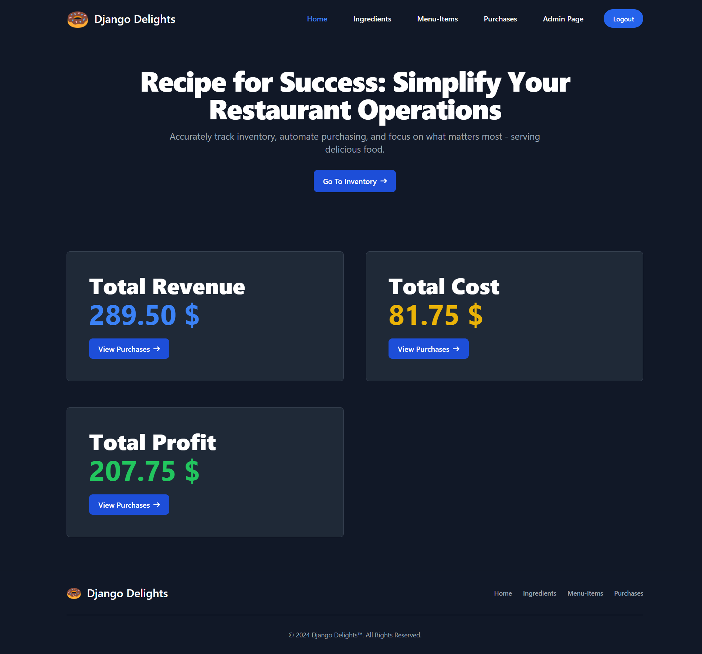
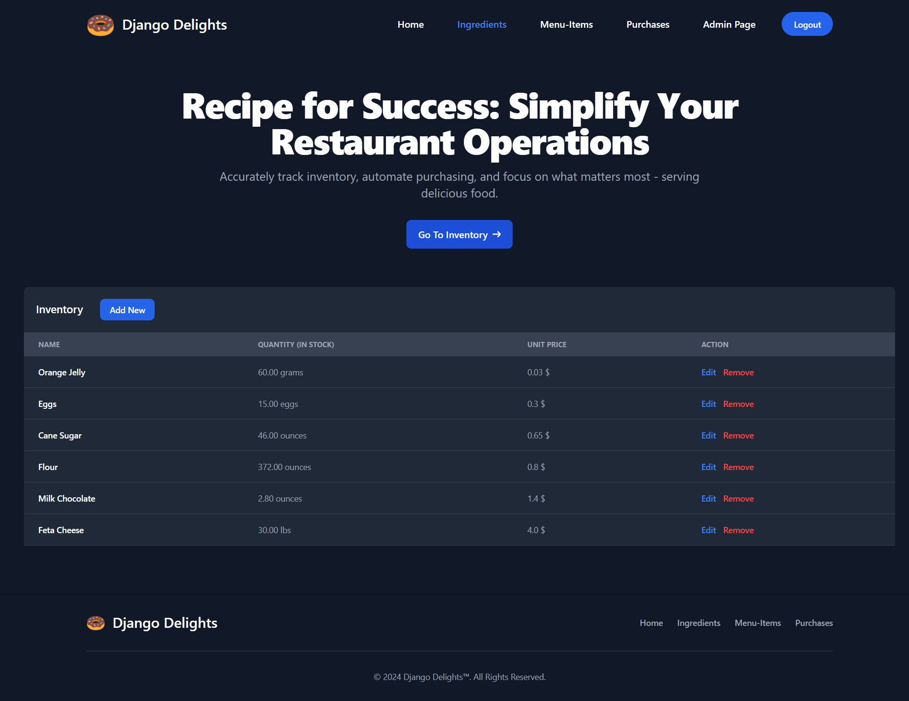
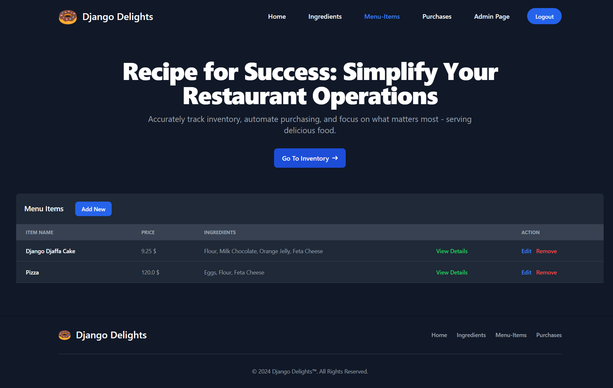
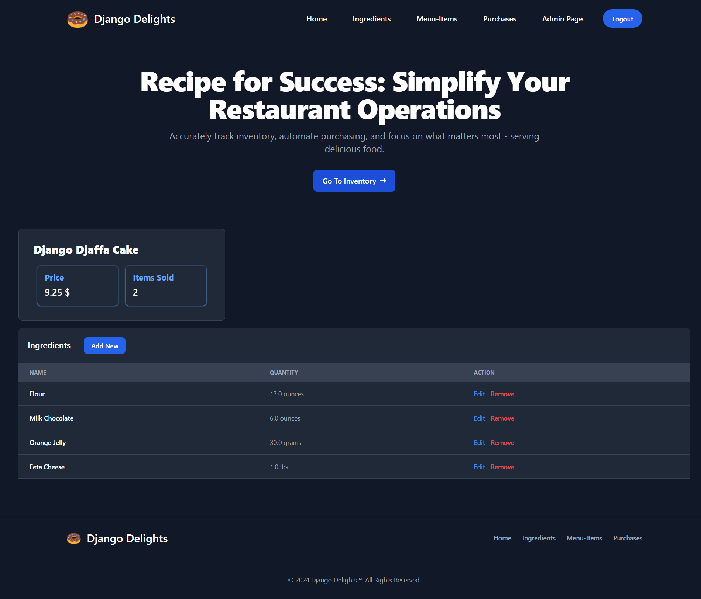
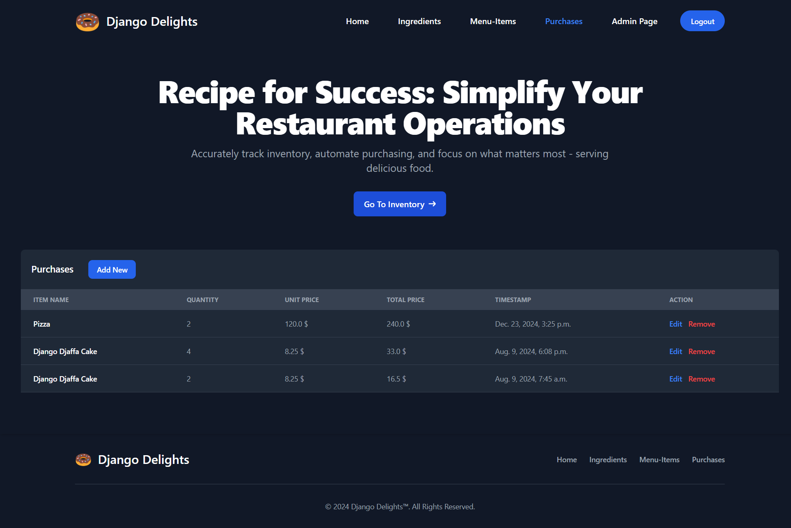

---

## 🚀 Installation

1. Clone the repository:
   
   ```bash
   git clone https://github.com/USMAN-FAIZYAB-KHAN/Django-Delights.git
   cd Django-Delights
   ```
3. Set up a virtual environment (optional but recommended):
   
   ```bash
   python -m venv venv
   source venv/bin/activate  # On Windows: venv\Scripts\activate
   ```
4. Install Dependencies:
   
   ```bash
   pip install -r requirements.txt
   ```
5. Run the development server:

    ```bash
   python manage.py runserver
   ```
Visit `http://127.0.0.1:8000/` to explore the application.
       
---

## 🗝️ Admin Credentials

To log in and test the application, use the following credentials:

- **Username:** admin  
- **Password:** P@ssword123
  
---

## 🗄️ Screenshots











---


